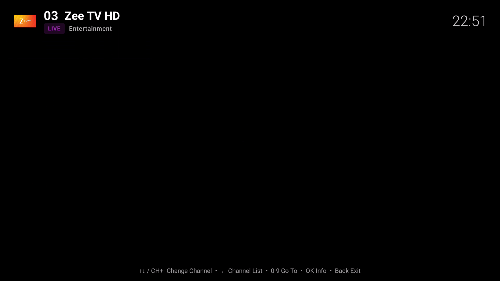
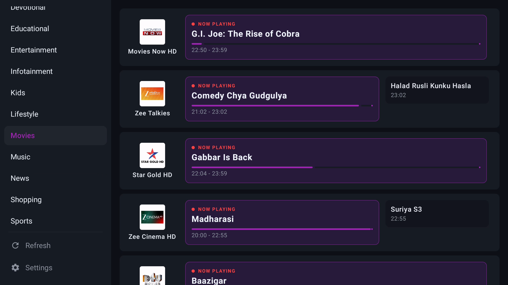
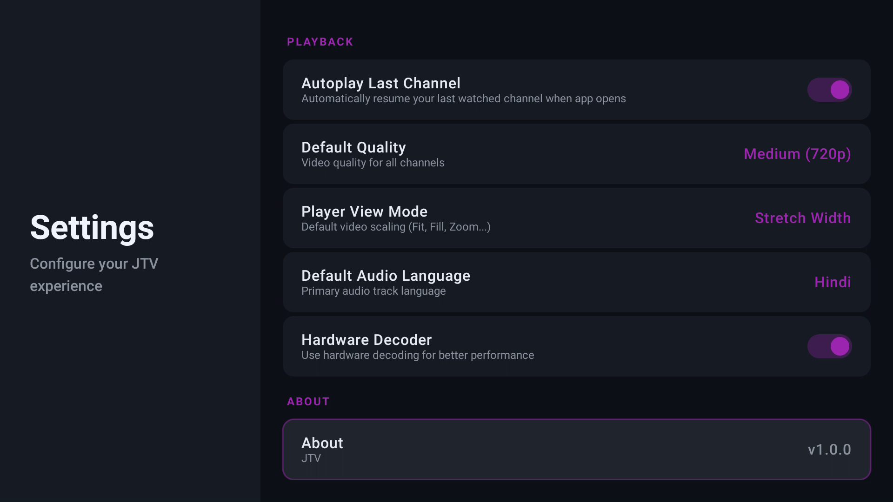
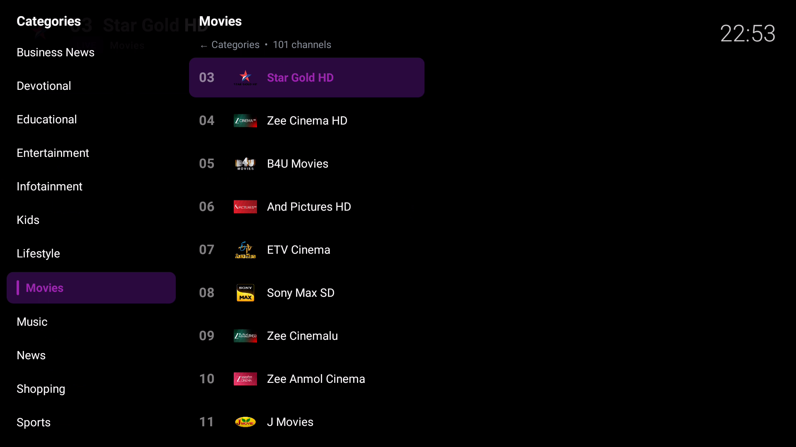
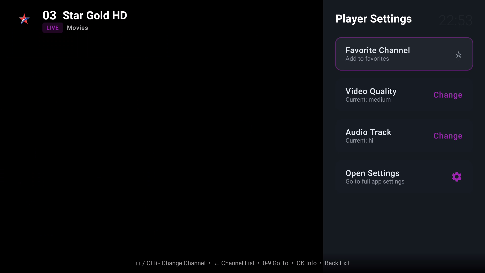
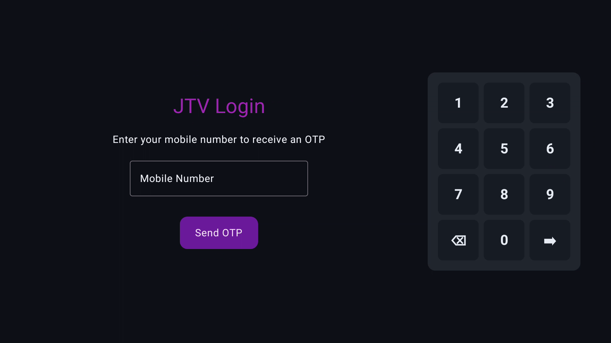
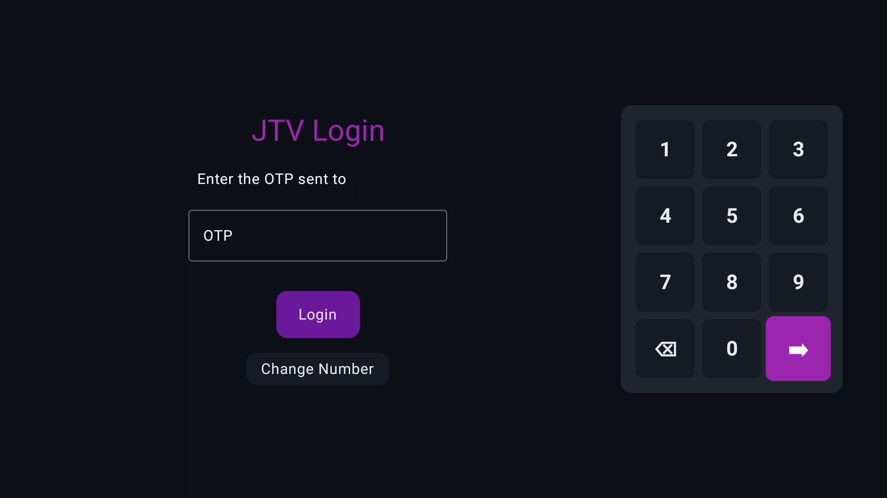

# JTV (Android TV Client)

A highly optimized, lightweight Live TV streaming application specifically designed for Android TV and Android boxes.

## Screenshots

<div align="center">
  
  
  
  
  
  
  
  
</div>

## Features

- **Seamless DRM Playback**: Plays Widevine-protected channels (Star, Sony, Zee, Colors, etc.). The short-lived Akamai stream token is refreshed transparently in the background and re-applied to every request (URL + cookie), so live channels keep playing without the periodic "buffering/black-screen" reload.
- **Hardware Accelerated Playback**: Custom ExoPlayer configuration with MediaCodec hardware acceleration prioritized and software fallback disabled by default, preventing the CPU from maxing out on low-end hardware.
- **Resilient Live Streaming**: Large, tunable buffers, back-buffer, gentle live speed control, and an error policy that retries transient `403/404` errors instead of failing — designed to ride out CDN jitter on weak networks.
- **Adjustable Playback Buffer**: Pick **Data Saver / Balanced / Smooth / Max** in Settings to trade memory for fewer interruptions.
- **Fast, Cached Channel List**: The channel list loads instantly from disk (stale-while-revalidate), then refreshes in the background — no waiting on the network at every launch.
- **EPG Integration**: Automatic XMLTV Electronic Program Guide parsing with a memory-friendly sliding-window model, plus native Jio per-channel EPG fallback. EPG is only fetched when enabled, keeping startup fast.
- **Modern TV UI**: Built entirely with Jetpack Compose for TV — native Numpad login, category/channel sidebars, numeric channel entry, and smooth D-pad navigation.
- **Quality-of-Life**: Sleep timer, favorites, autoplay last channel on boot, 12-hour clock, selectable video quality (up to 1080p) and audio language, and multiple aspect-ratio modes.
- **Amlogic Audio Sync Option**: Optional tunneling toggle (off by default) plus specialized audio-sink parameters for TVs that need it.

## Technical Stack

- **UI**: Jetpack Compose (Material TV)
- **Media**: AndroidX Media3 (ExoPlayer) — HLS + DASH/Widevine
- **Architecture**: MVVM with Kotlin Coroutines and StateFlow
- **Navigation**: AndroidX Navigation3
- **Data Persistence**: DataStore Preferences + app-scoped file cache
- **Min / Target SDK**: Android 7.0 (API 24) → Android 16 (API 36)

## Building from Source

1. Clone the repository:
   ```bash
   git clone https://github.com/F-e-n-y-x/JioTV-AndroidTV-.git
   ```
2. Open the project in Android Studio (or build from the CLI).
3. Build a debug APK:
   ```bash
   ./gradlew assembleDebug
   ```
   Output: `app/build/outputs/apk/debug/app-debug.apk`

### Release builds (signed)

Release builds are signed automatically **if** a `keystore.properties` file exists in the project root (it is gitignored). Create one alongside your keystore:

```properties
storeFile=jtv-release.keystore
storePassword=YOUR_STORE_PASSWORD
keyAlias=YOUR_ALIAS
keyPassword=YOUR_KEY_PASSWORD
```

Generate a keystore once with:
```bash
keytool -genkeypair -v -keystore jtv-release.keystore -alias jtv -keyalg RSA -keysize 2048 -validity 10000
```

Then build:
```bash
./gradlew assembleRelease
```
Output: `app/build/outputs/apk/release/app-release.apk` (minified, ~3–4 MB). If no `keystore.properties` is present, the APK is built unsigned.

## Installation

Sideload on your Android TV:
```bash
adb connect <YOUR_TV_IP>:5555
adb install -r app-release.apk
```
> Note: if you previously installed a build signed with a different key, uninstall first: `adb uninstall com.fenyx.jtv`

## Changelog

### v1.3
- **Added** in-player audio controls (right-side panel): **Voice Boost** (cuts background bass/treble + boosts the speech band + ducks loud background), **Auto Volume** (loudness normalize), and **Reduce Background** (night-mode compression) — useful on TVs with poor built-in audio settings.
- **Added** a real **Audio Track / Language** selector built from the stream's actual audio tracks, fixing channels whose language switching didn't work.
- **Fixed** opening full Settings from the player resetting playback to the originally launched channel — the current channel is now preserved.
- **Fixed** the player side-panel not scrolling (bottom items like "Open Settings" are now reachable).

### v1.2
- **Fixed** premium DRM channels (Star/Zee/Sony/Colors) cutting out every ~2 minutes — the expiring stream token is now refreshed transparently (URL **and** cookie).
- **Fixed** release-build crashes caused by incorrect ProGuard keep rules (wrong package name) stripping serializable navigation keys.
- **Fixed** black screens on Amlogic/MediaTek TVs — tunneling is now off by default (toggle in Settings).
- **Improved** playback resilience: bigger buffers, back-buffer, live speed control, and 403/404 retry handling.
- **Added** adjustable Playback Buffer setting, Sleep Timer, and a Tunneling toggle.
- **Improved** startup: channels load instantly from cache; EPG no longer parsed on every launch.
- **Raised** the "Auto" quality cap to 1080p.
- **Changed** the clock to 12-hour (AM/PM).
- **Fixed** the app icon (aspect-correct adaptive icon + raster fallbacks) and switched to a dark TV theme (no white boot flash).
- **Updated** `targetSdk` to 36 (Android 16); `minSdk` remains 24.

## Credits & Acknowledgements

This project was built with reference to and inspiration from the following open-source projects:
- [dineshintry/plugin.kodi.jiotv](https://github.com/dineshintry/plugin.kodi.jiotv)
- [JioTV-Go/jiotv_go](https://github.com/JioTV-Go/jiotv_go)

## Disclaimer

This is a custom, third-party Android TV client wrapper for educational use. It is not affiliated with, maintained, authorized, or endorsed by JioTV or Reliance Jio Infocomm Ltd in any way. Use of this software is at your own risk.
