<div align="center">


# JTV — Live TV, made easy

**Live TV that anyone at home can use: on the big TV with a plain remote, on your phone, and on your tablet.**

[](https://github.com/F-e-n-y-x/JioTV-AndroidTV-/releases/latest)
[](https://github.com/F-e-n-y-x/JioTV-AndroidTV-/releases)

[](https://github.com/F-e-n-y-x/JioTV-AndroidTV-/releases)
[](LICENSE)

<a href="https://github.com/F-e-n-y-x/JioTV-AndroidTV-/releases/latest"><b>⬇️ Download stable (1.5.x)</b></a>
&nbsp;·&nbsp;
<a href="https://github.com/F-e-n-y-x/JioTV-AndroidTV-/releases"><b>🧪 Try the v2 beta</b></a>

</div>

---

## 🧪 Meet JTV 2.0 (beta)

A ground-up redesign called **"Everyday"**. It has a calm near-black or light look, one warm amber accent, and the same layout on every screen size. It is tuned for 10-foot TV viewing and for people who just want to watch TV.

### On the TV

<div align="center">
  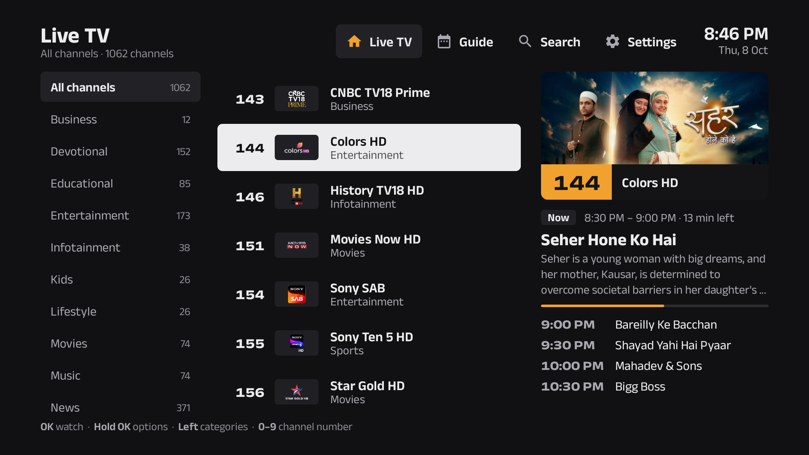
  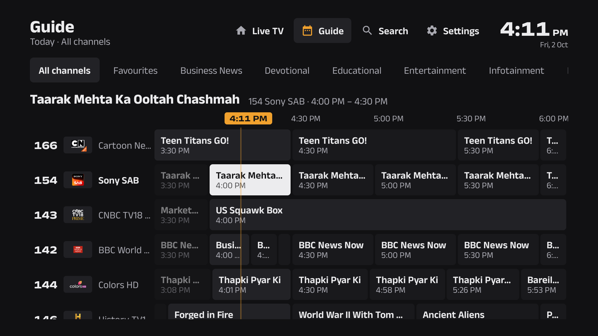
  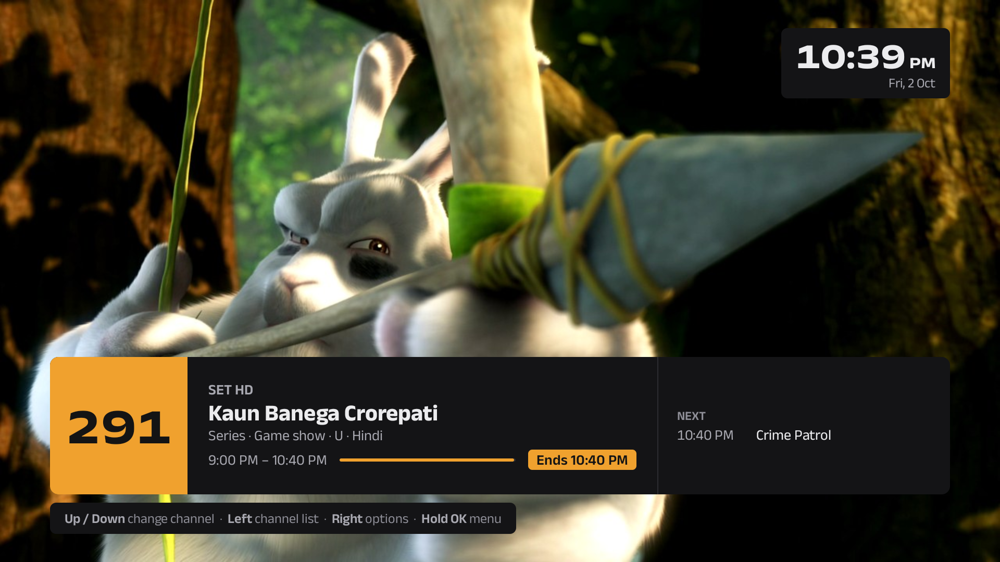
  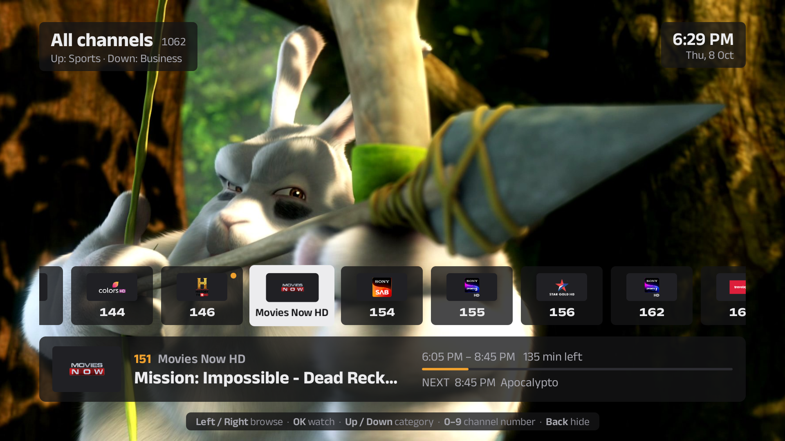
</div>

- **What's on now, at a glance.** Every channel shows its number, logo, current show and how long is left. Press **OK** to watch.
- **A real programme guide.** A time grid with a gentle "now" line. Press **Up** for categories, and **Up** again for the Live TV · Guide · Search · Settings tabs.
- **The amber channel strap.** Change channel and a broadcast-style strap shows the big channel number, the show, "Series · Drama · U · Hindi", time left and what's next.
- **Browse without stopping the show.** Press **←** while watching to slide channel tiles over the picture. Use **← →** to look around, **↑ ↓** to change category, and **OK** to switch.
- **One clear Options panel (→).** It holds **Language** (no more duplicate "Hindi, Hindi"), plain-word picture quality ("Best picture", "Data saver"), aspect, Voice Boost, sleep timer and favourite.

### On your phone and tablet

<div align="center">
  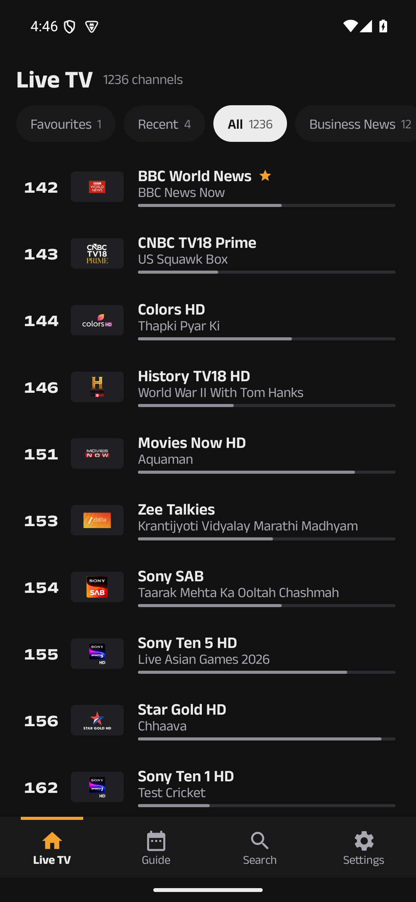
  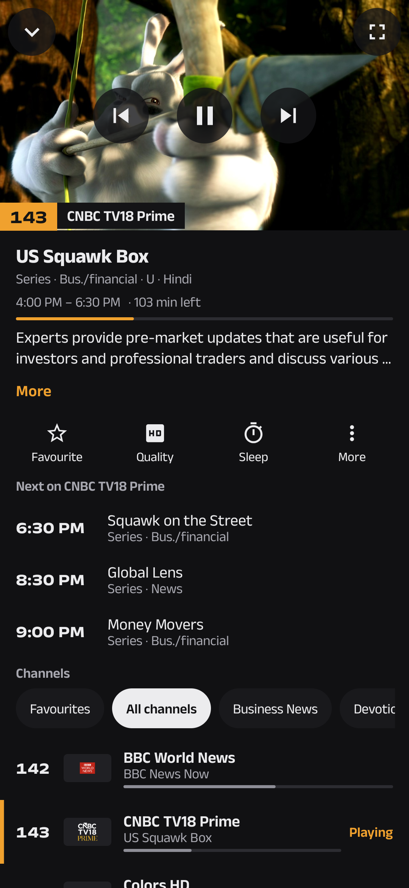
  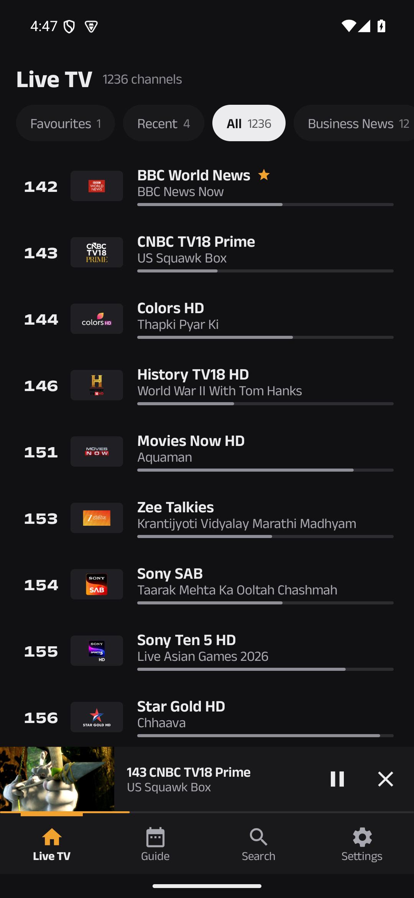
  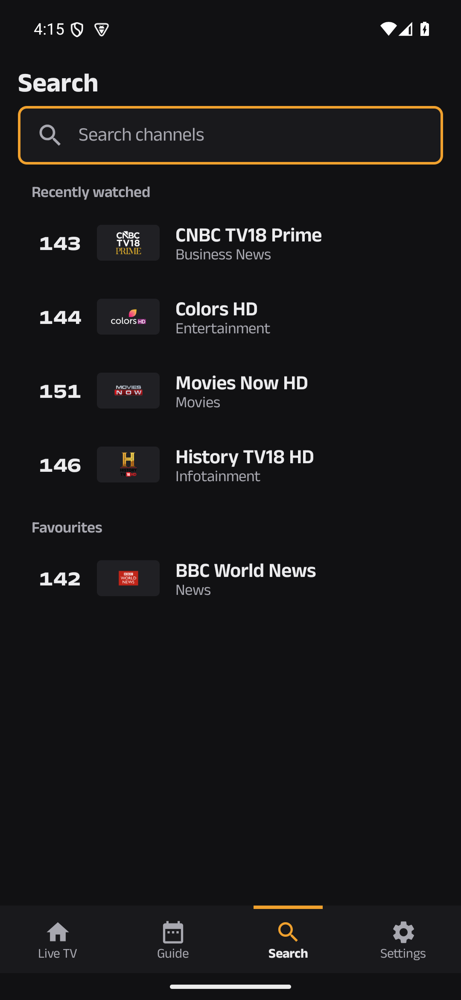
  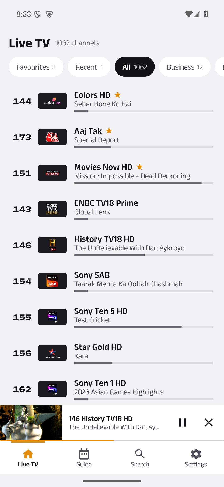
</div>
<div align="center">
  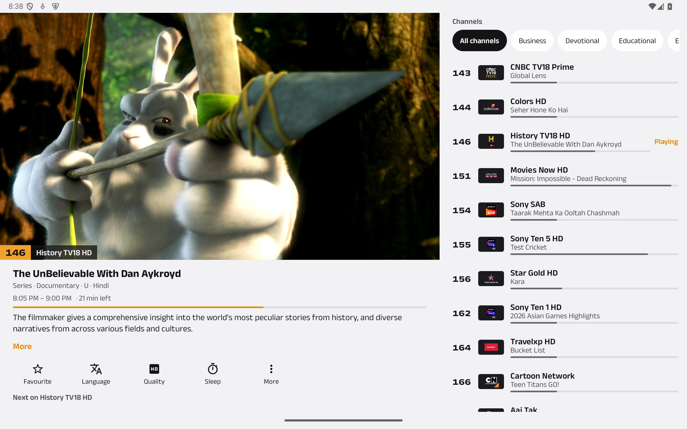
  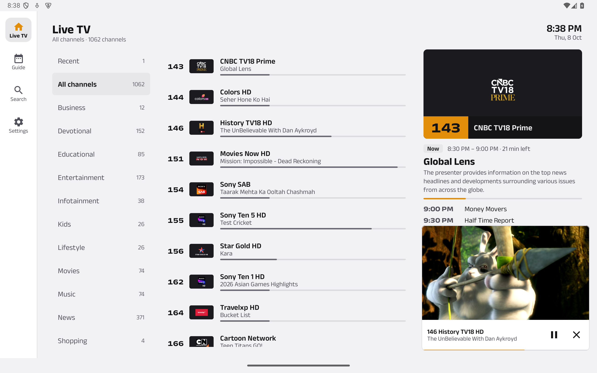
</div>

- **A YouTube-style player.**
  - Phone: the video sits on top, with the show info, a compact action row and the channel list below it.
  - Tablet: the video and details are on the left, the channels on the right.
- **Mini player.** Press Back, or the ⌄ button, to shrink the video into a bar (phone) or a floating card (tablet). It keeps playing while you browse.
- **Landscape that doesn't hide the picture.** Small round controls sit at the edges, with one slim info line. The channel tiles appear only when you tap the list icon.
- **Light and near-black dark modes.** They follow your phone's setting, or you can choose one in Settings.

### Everywhere

- ⭐ **Favourites that follow you.** Pair your phone and TV once with a 4-digit code (**Settings → Devices**). After that, favourites stay in sync over home Wi-Fi, with no server needed.
- 📺 **Play on TV.** From your phone, open a channel's options and choose **Play on <TV name>**. The TV switches channel.
- 🕘 **Recent.** Your last channels are one tap away, on the home screen and in Search.
- 💾 **Favourites backup.** Save them to a file and restore them after a fresh install.
- 🪶 **Still tiny.** The APK is about **4 MB** and runs smoothly on cheap TV boxes.

> **Beta notes:** v2 is released as a **pre-release**, so the stable app never updates to it by itself. Install the beta APK over 1.5.x and your login and favourites are kept. Once on the beta, you'll be offered newer betas and the final 2.0. Found something odd? [Open an issue](https://github.com/F-e-n-y-x/JioTV-AndroidTV-/issues) and tell me your device. It really helps.

---

## 📥 Install

1. Download the APK:
   - **Stable:** `JTV-v1.5.x.apk` from [Releases → Latest](https://github.com/F-e-n-y-x/JioTV-AndroidTV-/releases/latest).
   - **Beta:** `JTV-v2.0-beta.apk` from [Releases](https://github.com/F-e-n-y-x/JioTV-AndroidTV-/releases), marked *Pre-release*.
2. **Install it on your TV.**
   - The easiest way is to copy it to a USB stick and open it with a file manager such as **X-plore** or **File Commander**.
   - Or use ADB:
     ```bash
     adb connect <YOUR_TV_IP>:5555
     adb install -r JTV-v1.5.8.apk
     ```
3. **Sign in.** Use your Jio number and OTP, or connect to your own [JTV server](#%EF%B8%8F-companion-server-optional) with an access code.

Updates arrive through the in-app updater. All releases are signed with the same key, so updating keeps your login and favourites.

---

## 🎮 Remote controls (stable 1.5.x)

| Button | In the channel grid | While watching |
|---|---|---|
| **↑ / ↓** | Move | Change channel |
| **CH+ / CH−** | — | Change channel |
| **←** | — | Open channel list / categories |
| **→** | — | Player side panel (audio, quality, sleep timer…) |
| **OK** | Open channel | Show/hide channel info |
| **Hold OK** | Channel menu: favourite, move, group by category | — |
| **0–9** | — | Jump to a channel number |
| **Back** | Exit app | Close overlay / exit player |

---

## ⭐ Favourites: add, reorder, group, back up

1. **Add:** on any channel, **hold OK** and choose **Add to Favorites**.
2. **Reorder:** in **★ Favorites**, hold OK on a channel and choose **Move**.
   - ◀ ▶ moves it one place; ▲ ▼ moves it a whole row.
   - **OK** saves, **BACK** cancels.
   - **Move to top** and **Move to bottom** are one-press shortcuts.
3. **Group by category:** choose this to line them up as all News, then Movies, then Music. Categories keep the order they first appear in.
4. **Back up and restore** (Settings → Favourites):
   - **Back Up Favourites** saves them to `Downloads/JTV-favourites-backup.json`, which stays after you uninstall.
   - After a fresh install, choose **Restore Favourites**.
   - On boxes without a file picker, open the file with JTV from any file manager.

Your order is used everywhere, including in the player: CH+/CH− follow it.

<div align="center">
  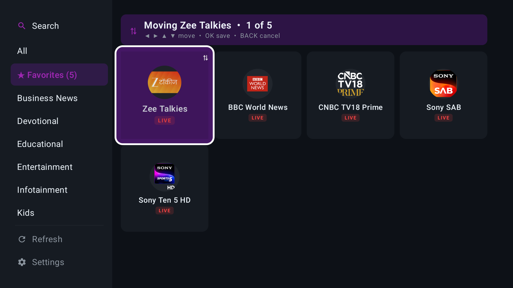
  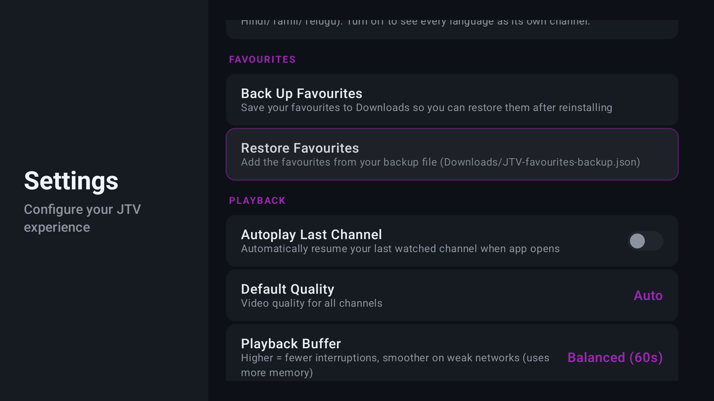
</div>

---

## 🔊 Voice Boost (dialogue enhancer)

Many channels mix dialogue too quietly under loud music and effects, and most TVs can't fix that. JTV can.

1. Open the player panel (**→**).
2. Choose **Voice Boost**: Off → Low → Medium → High → Max.

It lifts the voice and lowers the background while keeping the bass full. **Medium** or **High** suits most shows. Pair it with **Auto Volume** to even out loudness between channels.

---

## 🖥️ Companion server (optional)

A self-hosted server lets you **sign in once and share it with every TV** at home. It also gives you a web player and an M3U playlist for other apps. It's one Docker image (Node + React).

- **One login for all your TVs.** The server keeps your Jio login fresh, and each TV connects with a short access code.
- **Web player.** Channel grid, TV guide, catch-up and favourites in the browser.
- **M3U and EPG for IPTV players.** VLC, TiviMate, OTT Navigator and Kodi, with a full programme guide.

```bash
cd server && docker compose up -d --build   # then open http://<host>:8080
```

See **[`server/README.md`](server/README.md)** for setup and the API.

---

## 🛠️ Building from source

You need the Android SDK and JDK 17 or later.

```bash
git clone https://github.com/F-e-n-y-x/JioTV-AndroidTV-.git
cd JioTV-AndroidTV-/android
./gradlew assembleDebug        # → app/build/outputs/apk/debug/app-debug.apk
```

The v2 beta lives on the [`v2-lab`](https://github.com/F-e-n-y-x/JioTV-AndroidTV-/tree/v2-lab) branch.

<details>
<summary><b>Signed release builds</b></summary>

1. Put a `keystore.properties` file next to `android/gradlew`. It's gitignored.
   ```properties
   storeFile=jtv-release.keystore
   storePassword=YOUR_STORE_PASSWORD
   keyAlias=YOUR_ALIAS
   keyPassword=YOUR_KEY_PASSWORD
   ```
2. Create the keystore once:
   ```bash
   keytool -genkeypair -v -keystore jtv-release.keystore -alias jtv -keyalg RSA -keysize 2048 -validity 10000
   ```
3. Build:
   ```bash
   ./gradlew assembleRelease
   ```

</details>

| Area | Technology |
|---|---|
| UI | Jetpack Compose (Compose for TV on TV), custom "Everyday" design system |
| Media | AndroidX Media3 / ExoPlayer (HLS + DASH/Widevine) |
| Architecture | MVVM · Kotlin Coroutines · StateFlow · Navigation 3 |
| Storage | DataStore + on-disk cache |
| Sync | Local-network discovery (NSD) with paired devices, no cloud |

---

<details>
<summary><b>📸 Stable 1.5.x screenshots</b></summary>
<div align="center">
  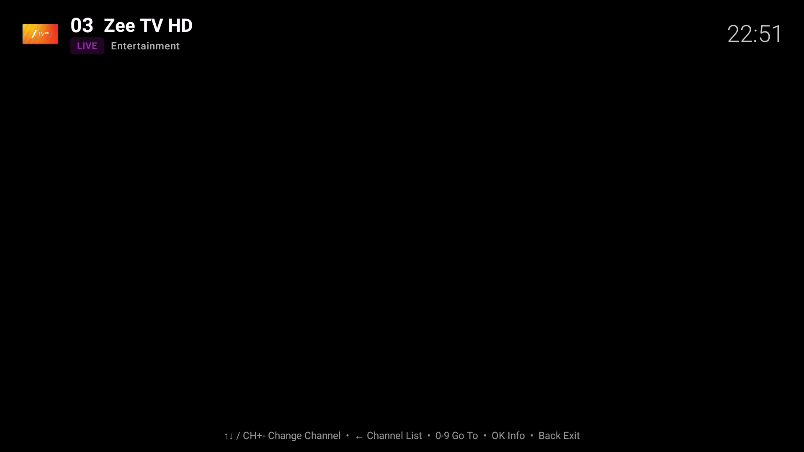
  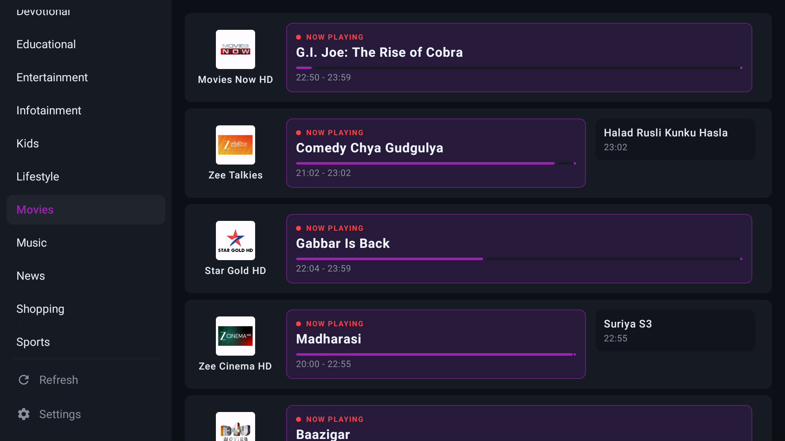
  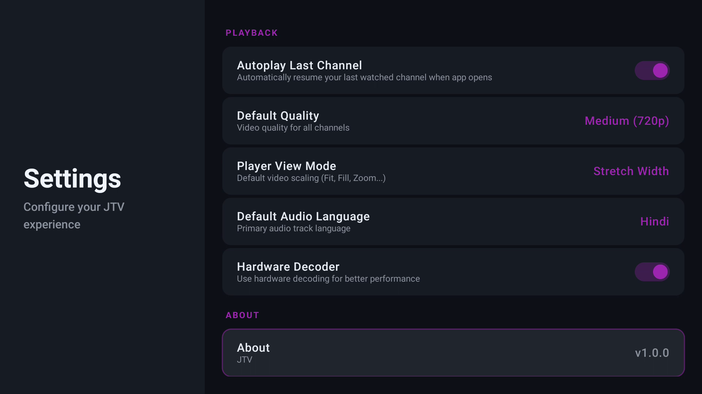
  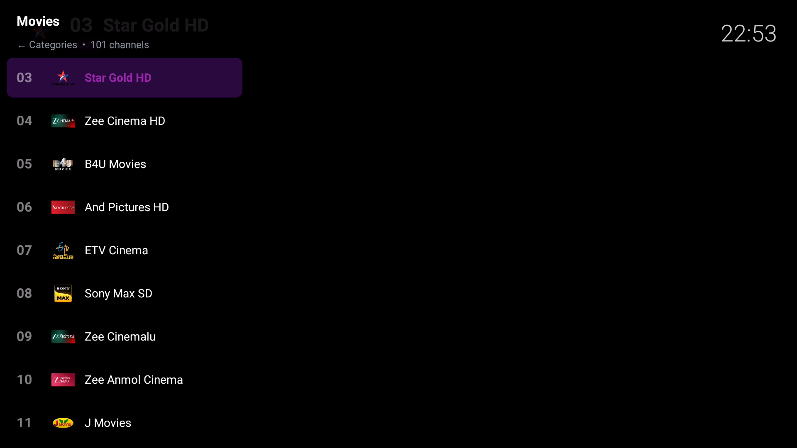
  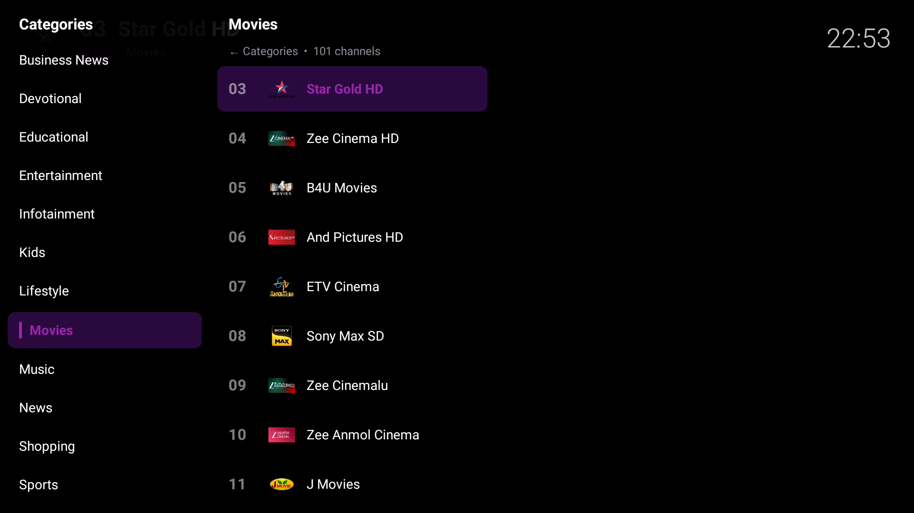
  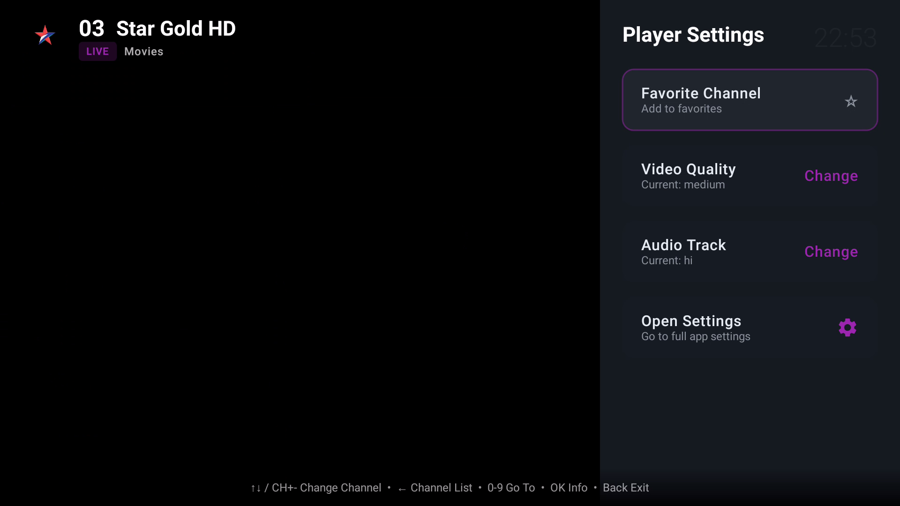
</div>
</details>

<details>
<summary><b>📝 Changelog</b></summary>

### v2.0-beta (pre-release)

The **"Everyday"** redesign for TV, phone and tablet:
- New home, guide, player strap, channel browser, options panel and search.
- YouTube-style phone and tablet player, with a mini player.
- Light and near-black dark themes, and 12-hour time.
- One clean Language menu, with plain-word picture quality.
- Show details: type, genre, rating, cast and director.
- A Recent category.
- Wi-Fi favourites sync with "Play on TV", plus favourites backup.

### v1.5.9
- **Streams no longer stop when Voice Boost is Off** (reported by @sant009m in #3). With Voice Boost
  set to Off, the audio filter crashed on the empty buffer the player sends after every channel change
  or stream reload, so playback stopped after a few retries. Fixed, with a test that reproduces it.
- **A safety net for frozen playback.** If the picture stops moving for 8 seconds with no error, JTV
  restarts the audio and then reloads the stream by itself.
- **Sony Yay and other "recorded schedule" channels play correctly.** Jio streams these as one
  recorded episode per programme. JTV now starts at the scheduled point and loads the next programme
  when one ends, instead of playing an old episode from the beginning.
- **Correct channel languages.** Ten of Jio's language IDs were mapped wrongly (for example Sony Yay
  Tamil showed as Telugu), which could make "Group languages together" pick the wrong feed.

### v1.5.8
- **Hold OK now keeps the menu open** (reported in issue #1). On remotes without a mouse, releasing a
  held OK used to count as a click: the channel opened at once and the menu disappeared, so you
  couldn't pick **Add to Favorites** or **Move**. Now the menu stays open until you press OK on the
  option you want.
- **Back up and restore favourites.** In **Settings → Favourites**, save your favourites to
  `Downloads/JTV-favourites-backup.json` and restore them after reinstalling. Restore adds to your
  current favourites and never deletes any. On boxes without a file picker, open the backup file
  with JTV from a file manager.

### v1.5.7
- **Stays signed in even if Jio drops the session.** If Jio ever rejects the saved login, JTV now
  rebuilds the session from your existing sign-in (the same token exchange the JioTV apps use)
  instead of asking for a new OTP. Works for phone sign-in (after signing in once on v1.5.7) and the
  JTV server.
- **No more refresh spam from an error screen.** While the player shows an error, it stops
  re-requesting the stream every minute.
- **Server: full TV guide for IPTV players.** `/epg.xml` (and the new `/epg.xml.gz`) now include the
  programme schedule (yesterday–tomorrow) for every channel, built in the background from Jio's own
  guide. Before, TiviMate/Kodi showed an empty guide.
- **Server: safer stream proxy.** It only fetches from Jio's own servers, so your Jio tokens can never be
  sent anywhere else.
- **Server: crash-safe settings.** `config.json` is written atomically with a `.bak` copy, so a power cut
  can't wipe the admin password.

### v1.5.6
- **Streams no longer stop after a while** (issue #3). Jio's login has a 12-hour access token and a
  refresh token that breaks if it's used several times at once. JTV used to refresh only *after* the
  token had expired, and also on every channel Jio refuses (each Zee channel press), sometimes in
  parallel. That eventually made Jio reject the refresh token, and only a new sign-in helped.
  Now the app and the server:
  - refresh **before** the token expires (and in the background while the TV is idle),
  - allow **only one refresh at a time**,
  - never refresh because of a refused channel,
  - and, if Jio does end the session, say so clearly ("sign in again") instead of retrying forever.

### v1.5.5
- **More Zee channels play again.** Zee Bangla, Zee Tamil, Zee Yuva, Zee Cinemalu, Zee Sarthak,
  Zee Classic and Zee Bangla Sonar were failing because Jio sends a broken DASH link for them. JTV now
  checks it and switches to the working HLS stream, and sends the correct headers for its decryption key.
- **Clear message when Jio doesn't carry a channel.** Most other Zee Entertainment channels (Zee TV,
  Zee Cinema, &Pictures, Zee Talkies…) have been removed from JioTV by Jio itself: every Jio endpoint
  refuses them or returns an empty stream. Instead of retrying 5 times and then wrongly saying
  "login expired", the player now tells you straight away that the channel isn't available from Jio.

### v1.5.4
- **Reorder your favorites.** In ★ Favorites, hold OK on a channel and pick **Move**, then place it with
  the arrow keys (▲▼ jump a whole row). Press OK to save or BACK to cancel. The menu also has
  **Move to top**, **Move to bottom** and **Remove from Favorites**.
- **Group favorites by category.** One press lines your favorites up by category, e.g. all News, then
  all Movies, then Music. Categories keep the order they first appear in, so move one News channel to
  the top first to put News first.
- **Favorites everywhere.** Hold OK on any channel to add it to favorites without opening it. The
  sidebar shows how many you have, and the player's category list (press ← twice) now starts with ★ Favorites,
  so CH+/CH− follow your own order.
- Mouse, air-mouse and touch taps now always act on the item you tapped.

### v1.5.3
- **Self-Healing Token Refresh**: Fixed a nested control-flow bug in `refreshToken` ensuring non-2xx failures correctly propagate and auto-recovery reliably re-authenticates.
- **7-Day Catch-Up Horizon & VOD Replay**: Expanded EPG program parsing with show IDs (`srno`, `showId`, `showtime`, and `isCatchupAvailable`) and added `stream_type=Catchup` VOD playback support.
- **Upstream Upgrades**: Modernized API version code to `422` (JioTV v7.1.8), OkHttp headers to `4.12.0`, and stream user-agents to `plaYtv/7.1.8`.
- **Companion Server Negative Caching**: Added 60s cooldown cache for 404/403 dead channels to protect against upstream IP rate limiting.
- **IPTV Catch-Up & DRM Filtering**: Enhanced M3U playlists with `?drm=hide` and `?catchup=1` support for TiviMate, Kodi, and OTT Navigator.

### v1.5.2
- **No more reload a second into every channel.** The saved quality preference loaded *after* playback
  had already started and (needlessly) re-fetched the stream and re-prepared the player. Quality never
  affected the stream URL in the first place — it now applies to track selection only, so each channel
  loads exactly once.
- **Smoother picture on TV boxes.** Resolution switches are no longer allowed when they'd force the
  secure hardware decoder to tear down and re-initialise (which these MediaTek/Amlogic chips can't do
  seamlessly), and live-edge speed correction is now gentle and infrequent instead of nudging playback
  speed every second.
- Reverted two experimental playback options from v1.5.1 (Media3 dynamic scheduling, Widevine
  multi-session) — unproven, and not worth the risk to a steady picture.

### v1.5.1
- **Video quality now actually follows your setting.** Picking **High (1080p)** used to be a *ceiling*
  only, so playback still began on Jio's lowest rendition (as low as 320×180) and slowly crept up. The
  chosen quality is now a **floor as well as a ceiling**, and the player starts on the top rendition
  immediately instead of ramping. *(Verified on-device: 1080p @2.3 Mbps selected from the first segment.)*
- **Faster channel zaps on DRM channels** — playback no longer blocks on the Widevine license round-trip
  before rendering.
- **Lighter playback loop** on weak TV CPUs (Media3 1.11 dynamic scheduling).
- Toolchain/library currency: Kotlin 2.4.0 · Gradle 9.6.1 · AGP 9.2.1 · Compose 2026.06.01 ·
  Navigation3 1.1.4 · DataStore 1.2.1 · Coroutines 1.11.0 · core-ktx 1.19.0.

### v1.5.0
- **Platform modernization** — updated the build toolchain and core libraries: AGP 9.2 · Gradle 9.4.1 ·
  Kotlin 2.3.21 · Jetpack Compose 2026.06 · **AndroidX Media3 1.11** · Lifecycle 2.11 · Coil 2.7
  (`compileSdk 37`; `minSdk`/`targetSdk` unchanged).
- **Baseline Profile groundwork** — added a `:baselineprofile` module + ProfileInstaller so a
  generated launch→browse→play profile can be embedded for faster cold start on low-end TV boxes.
- **Tests** — added unit tests for stream-token extraction/expiry and EPG timestamp parsing.
- **Cleanup** — removed unused settings keys and a stale dependency entry.

### v1.4.0
- **Companion server** (self-hostable, Docker): log in once and share it across every TV, a full
  **browser web player** (channel grid, TV guide, catch-up, favourites, language filter), and an
  **M3U playlist generator** for external IPTV players (VLC/TiviMate/OTT Navigator) with EPG + catch-up.
- Non-DRM channels now **play in the browser over plain HTTP** (hls.js + server-side AES-key handling);
  DRM channels play over the server's HTTPS URL.
- **App:** fixed token auto-refresh (captures the refresh token at login and calls the refresh endpoint
  correctly), so the app recovers stale sessions on its own.

### v1.3.2
- Reworked **Voice Boost** into a 5-level dialogue enhancer (center-channel processing) with **bass preserved** and a presence boost for clarity — no more thin/hollow sound. The old "Reduce Background" toggle is merged in.

### v1.3
- In-player **audio controls** (Voice Boost, Auto Volume), a **real audio-track/language selector**, the current channel is kept when opening Settings, and the player side panel now scrolls.

### v1.2
- **DRM channels no longer cut out every ~2 minutes** (transparent stream-token refresh), fixed release-build crashes, off-by-default tunneling, smoother buffering, instant cached startup, app-icon fix, and `targetSdk 36`.

See the [Releases page](https://github.com/F-e-n-y-x/JioTV-AndroidTV-/releases) for full notes and downloads.

</details>

---

## 🙏 Credits

Built with reference to, and inspiration from:
- [dineshintry/plugin.kodi.jiotv](https://github.com/dineshintry/plugin.kodi.jiotv)
- [JioTV-Go/jiotv_go](https://github.com/JioTV-Go/jiotv_go)

The UI font is [Anek Latin](https://github.com/EkType/Anek) (SIL Open Font License).

## ⚖️ Disclaimer

JTV is an independent, unofficial client made for **educational purposes**. It is **not** affiliated with, authorised, maintained, or endorsed by JioTV, Jio Platforms or Reliance. You need a valid Jio account to sign in, and you're responsible for how you use it.

## 📄 License

[Apache License 2.0](LICENSE). You're free to use, modify, fork or port JTV, as long as you keep the copyright and licence notice ([NOTICE](NOTICE)).
